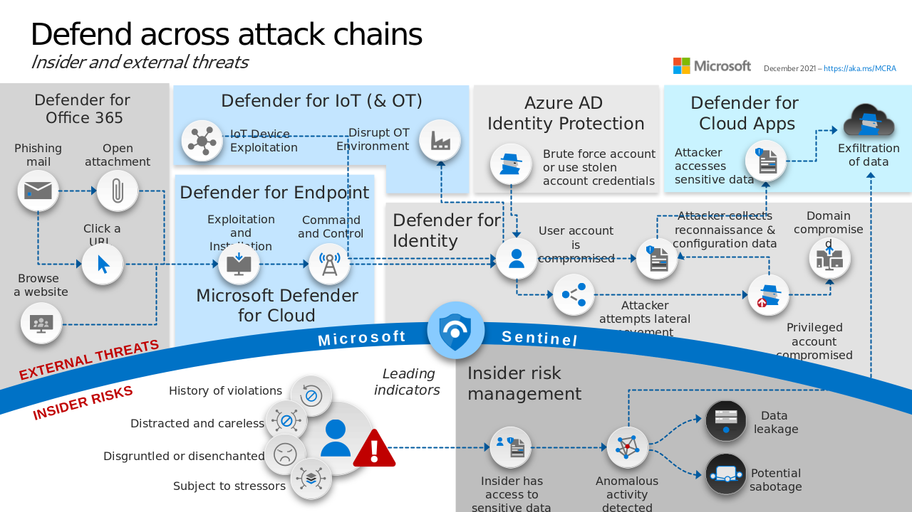

# Microsoft Defender Field Guide



Slide 15 of [Microsoft Cybersecurity Reference Architectures](https://aka.ms/MCRA)

Comprehensive resource for understanding, implementing, and optimizing Microsoft Defender.

This field guide is meticulously curated to provide security professionals, system
administrators, and IT enthusiasts with in-depth knowledge and practical insights to
effectively secure their systems and networks using Microsoft Defender.

## Contribute

Pull requests are welcome.

## Table of Contents

- [Microsoft Defender Field Guide](#microsoft-defender-field-guide)
  - [Modules and PowerShell](#modules-and-powershell)
  - [Defender for Endpoint](#defender-for-endpoint)
    - [Deploy with Intune](#deploy-with-intune)
    - [Deploy with Configuration Manager](#deploy-with-configuration-manager)
    - [Integration with Other Microsoft 365 Services](#integration-with-other-microsoft-365-services)
  - [Defender for Office 365](#defender-for-office-365)
  - [Defender for Cloud](#defender-for-cloud)
  - [Defender for Cloud Apps](#defender-for-cloud-apps)
  - [Defender for Identity](#defender-for-identity)
  - [Defender for Vulnerability Management](#defender-for-vulnerability-management)
  - [Microsoft 365 Defender](#microsoft-365-defender)

## Modules and PowerShell

Security & compliance, Exchange Online (EXO), and Exchange Online Protection (EOP) and others
have remote PowerShells.

Install Graph device management PowerShell cmdlets.

```powershell
Install-Module -Name Microsoft.Graph.DeviceManagement
```

## Defender for Endpoint

[Supported hardware and software](https://learn.microsoft.com/en-us/microsoft-365/security/defender-endpoint/minimum-requirements?view=o365-worldwide#hardware-and-software-requirements)
has Defender for Endpoint (MDE) builtin, making the deployment phase to these devices easier.
Older versions of Windows and
[Other](https://learn.microsoft.com/en-us/microsoft-365/security/defender-endpoint/minimum-requirements?view=o365-worldwide#other-supported-operating-systems)
devices require agents for provide data to MDE.

Minimum hardware requirements for MDE on Windows devices are the same as the requirements
for the operating system (that is, they aren't in addition to the requirements for the
operating system).

### Deploy with Intune

Create a new Group to target Users or Devices with an Endpoint detection and response (EDR)
policy that turns on MDE.

```powershell
$group = New-AzureADMSGroup -DisplayName "New MDE Group" -MailEnabled $false -SecurityEnabled $true -MailNickName "NotSet"
```

Create an EDR policy device configuration.

```powershell
$params = @{
  "@odata.type" = "#microsoft.graph.windowsDefenderAdvancedThreatProtectionConfiguration"
  description = "New EDR Policy"
  displayName = "New EDR Policy"
  version = 7
  allowSampleSharing = $true
  enableExpeditedTelemetryReporting = $true
}

$deviceConfiguration = New-MgDeviceManagementDeviceConfiguration -BodyParameter $params
```

Create device configuration assignment to security group.

```powershell
$params = @{
  "@odata.type" = "#microsoft.graph.deviceConfigurationAssignment"
  target = @{
    "@odata.type" = "microsoft.graph.configurationManagerCollectionAssignmentTarget"
    collectionId = $group.Id
  }
}

New-MgDeviceManagementDeviceConfigurationAssignment -DeviceConfigurationId $deviceConfiguration.Id -BodyParameter $params
```

### Deploy with Configuration Manager

Instructions to deploy with Configuration Manager.

### Integration with Other Microsoft 365 Services

MDE intergrates with Microsoft Intune, Defender for Office 365, and Defender for Cloud Apps.

## Defender for Office 365

Protect Office 365 users With message safety features like Anti-Spam, Anti-Phishing, Safe Links,
Safe Attachments, and Safe Documents.

## Defender for Cloud

An umbra of Microsoft products and services that protect cloud assets. Defender for Key Vault,
Defender for Servers, Defender for DNS, and others.

## Defender for Cloud Apps

## Defender for Identity

On-premise identity protection.

## Defender for Vulnerability Management

## Microsoft 365 Defender

The single pane application that aggregate signals.
